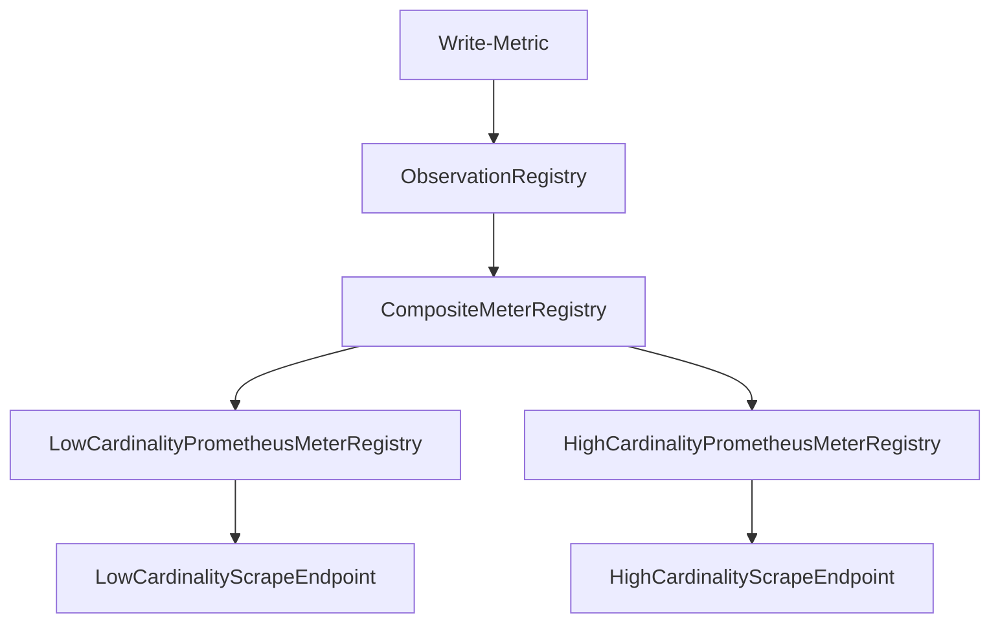

# observability

this repo contains a spring boot application that attempts to store high cardinality metrics. It uses
two PrometheusMeterRegistrys to separate metrics, one for high cardinality metrics and the other for low.

It also exposes two prometheus endpoints so that can be scraped individually.

## Overview

* We only want to write each metric once
* If `allow-high` is set to true
  * Write low cardinality metrics to the "low" endpoint
  * Write high cardinality metrics to the "high" endpoint
  * The logs should not be littered with log warnings
* If `allow-high` is set to false (default)
    * Write low cardinality metrics to the "low" endpoint
    * Do nothing with high cardinality metrics
    * The logs should not be littered with log warnings

